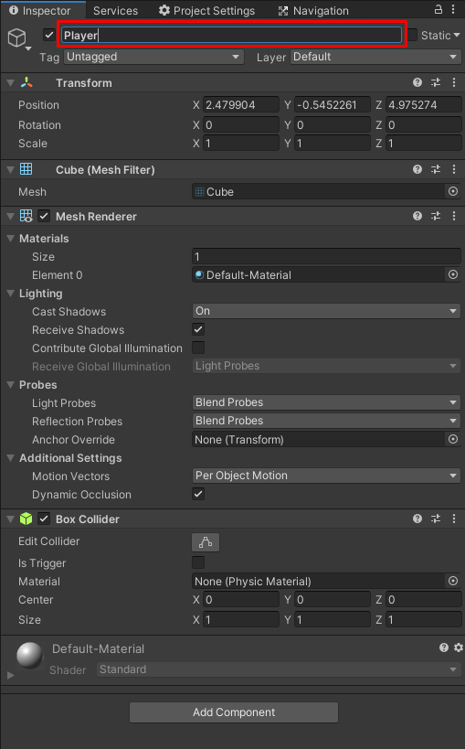

# Modul-Game-Dev-1-LBE-GIGa

## Membuat project unity

## Layout Unity
Unity adalah Game Engine Cross-Platform yang dikembangkan oleh Unity Technologies. Berikut adalah layout editor yang paling umum.

- (A) Toolbar memberikan kontrol ke scene view dan game object. Bagian kiri ada hand tool, move tool, rotate tool, scale tool, rect tool, multi tool. Bagian ditengah ada kontrol play, pause, dan step control. Bagian dikanan ada kontrol untuk unity collab, account, layers dan layout.
- (B) Hierarchy berisi representasi struktur game object di scene. Jadi semua game objek di scene dapat dilihat di hierarchy.
- (C) Game View menunjukkan apa yang dilihat oleh kamera atau yang akan dilihat oleh pemain.
- (D) Scene View adalah cara kita untuk melihat atau mengedit game objek yang ada di scene. Scene View dapat melihat scene dari prespektif 2D atau 3D.
- (E) Inspector View menunjukkan list komponen - komponen beserta propertinya untuk objek yang sedang diselect.
- (F) Project Window menunjukkan file atau asset yang dapat digunakan dalam gamenya.
(https://docs.unity3d.com/Manual/UsingTheEditor.html)

## Membuat object player

### Membuat Game Object

Untuk membuat player, kita harus membuat game object terlebih dahulu. Apa itu game object?

Game Object adalah representasi objek didalam unity. Game Object dapat merepresentasikan karakter, prop, pohon, dan lain-lain. Game Object berfungsi sebagai container component. Component ini yang mempunyai fungsi atau tujuan masing-masing.

Cara membuat game object adalah dengan klik kanan di hierarchy.


Dalam box merah tersebut, kita dapat membuat game object. Beberapa sudah diberi preset oleh unity. Seperti **Light** berarti game object yang mempunyai component untuk lighting. Untuk membuat game object tanpa component apapun kita dapat memilih **Create Empty**.

Object player, kita mau untuk berbentuk kubus. Maka kita akan membuat game object yang sudah mempunyai component render kubus.


Maka dalam scene view akan terbuat cube.


Kita namai game object ini menjadi "Player" dengan mengubah namanya di inspector



### Membuat player bisa bergerak
Agar game disimulasikan dalam physics maka kita harus menggunakan **Rigidbody**. Apa itu rigidbody?

**Rigidbody** digunakan untuk membuat object tersebut disimulasikan dalam physics engine unity. Dengan ini object kita akan tersimulasikan oleh **Physics** seperti gravitasi, momentum, collision, dll. Meskipun begitu, kita tetap dapat mengatur properti seperti kecepatan ataupun langsung mengubah posisi tersebut.

Untuk menambahkan **Rigidbody** pada object Player. Kita harus select object tersebut, lalu klik **Add Component** di inspector.


Lalu ketik "Rigidbody" pada search barnya dan pilih **Rigidbody** bukan **Rigidbody2D**.


Dengan ini akan ada component baru bertipe Rigidbody. 

Jika kita mau menghapus component kita dapat mengklik titik tiga di pojok kanan atas component. Lalu pilih Remove Component. Ini dapat bekerja disemua component kecuali Transform.


Pada Rigidbody, kita akan membuka constraint lalu mengecek Freeze Rotation untuk semua axis kecuali Y.


Jika di play player akan bergerak kebawah.

## Membuat Player bisa Bergerak bebas

### Membuat Plane

Sebelum kita membuat script untuk player bisa jalan. Kita harus membuat arena untuk player bergerak. Untuk itu kita bisa membuat plane sebagai tanah.


Kita dapat mengubah besar dan melakukan rotasi menggunakan toolbar.


Lalu buatlah arena dengan bentuk yang kalian mau. Disini akan menggunakan kubus. Berikut merupakan level yang saya buat.


Selanjutnya kita akan membuat script player. Buatlah folder dalam hierarchy bernama Scripts. Lalu klik kanan dan pilih **Create** >> **C# Script** pada folder **Scripts**.


Beri nama **Player**. Lalu masukkan kode berikut.

```cs
using System.Collections;
using System.Collections.Generic;
using UnityEngine;

public class Player : MonoBehaviour {

	[SerializeField] private float speed = 5;

	private Vector3 dir;
	private Rigidbody rb;

	private int coin = 0;
	public int Coin {
		get {
			return coin;
		}
		set {
			coin = value;
		}
	}

	private void Start() {
		rb = GetComponent<Rigidbody>();
	}

	private void Update() {
		InputHandling();
	}

	private void InputHandling() {
		dir.x = Input.GetAxis("Horizontal");
		dir.z = Input.GetAxis("Vertical");
	}

	private void FixedUpdate() {
		if(dir != Vector3.zero) {
			RotatePlayerFaceToDir();
		}
		MovePlayerToDir();
	}

	private void RotatePlayerFaceToDir() {
		Quaternion newRotation = Quaternion.LookRotation(dir);
		transform.rotation = Quaternion.Lerp(transform.rotation, newRotation, .1f);
	}

	private void MovePlayerToDir() {
		Vector3 velocity = dir * speed;
		velocity.y = rb.velocity.y;
		rb.velocity = velocity;
	}

}
```

Pasang script tersebut ke dalam object **Player** dengan menggunakan **Add Component**.

Untuk membedakan player dengan object lainnya. Buatlah folder bernama **Material**. Dalam folder material buatlah material dengan klik kanan lalu pilih **Create** >> **Material**. Beri nama **Player**.


Lalu beri warna biru untuk player.


Untuk mengassign material, drag and drop material ke object Player.


## Membuat object coin

Coin akan collectible player. Coin akan menghilang saat sudah diambil oleh Player lalu coin player akan bertambah 1.

Buat **Game Object** berbentuk **Sphere**. Ubah besarnya menjadi 0.5 untuk setiap axis. Setelah itu buat **Material** bernama **Coin** dan beri warna kuning.

Lalu buat script bernama Coin. Lalu tuliskan kode berikut.
```cs
using System.Collections;
using System.Collections.Generic;
using UnityEngine;

public class Coin : MonoBehaviour {

	private void OnTriggerEnter(Collider other) {
		Player player = other.GetComponent<Player>();
		if(player != null) {
			player.Coin += 1;
			Destroy(gameObject);
		}
	}

}
```

Pasang script tersebut ke object coin. Dan ubah is trigger dalam object sphere menjadi true.


## Membuat object obstacle

**Obstacle** akan menjadi object yang menjadi penghalang player. Dengan ini player akan mempunyai tantangan player. Untuk obstacle, yang kita pakai adalah **Cube**.

Buatlah **Material** bernama **Obstacle** dan beri warna merah. Lalu assign material ini ke object.

Buat script bernama **Obstacle** lalu tulis kode berikut.

```cs
using UnityEngine;
using UnityEngine.SceneManagement;
using System.Collections;

public class Obstacle : MonoBehaviour {

	private void OnTriggerEnter(Collider other) {
		Player player = other.GetComponent<Player>();
		if(player != null) {
			Debug.Log("Game Over");
		}
	}
}
```

Untuk sementara obstacle hanya akan menampilkan message game over. Pada materi selanjutnya akan belajar cara mereset level. Dan ubah is trigger dalam collider menjadi true.


## Membuat object finish

**Finish** object adalah cara player menyelesaikan level dan menjadi tujuan utama player. Untuk object finish akan dibuat kotak juga.

Buatlah **Material** bernama **Finish** dan beri warna hijau. Lalu assign material ini ke object.

Buatlah script bernama **Finish** lalu tulis kode berikut.

```cs
using UnityEngine;
using System.Collections;

public class Finish : MonoBehaviour {

	private void OnTriggerEnter(Collider other) {
		Player player = other.GetComponent<Player>();
		if(player != null) {
			Debug.Log("Player Win");
		}
	}

}
```

Dan ubah is trigger dalam collider menjadi true.


Sama seperti object obstacle. Untuk sementara, finish object hanya akan menampilkan pesan.

## Mengubah Angle Camera

Dalam setiap scene, ada minimal 1 camera. Ubah posisi dan rotasi camera dengan transform tool. agar seperti gambar dibawah ini


Tekan tombol play.


